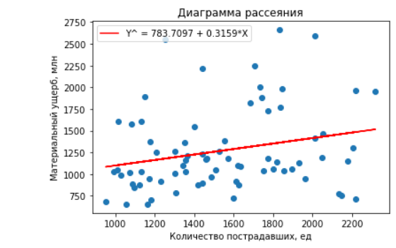
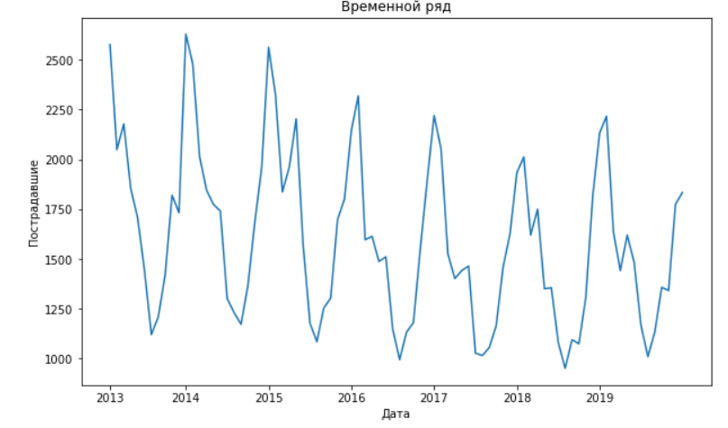
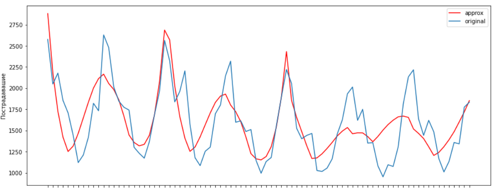

# Econometricks
Statistical study of the consequences of fires in Russia

Данные собраны из источника "Пожары и пожарная безопасность" за 2013 - 2019г. Рассматриваются параметры: количество пожаров и пострадавших, а также материальный ущерб.

**1. В файле pair_regress.ipynb рассматривается парная линейная регрессия,где регрессор - пострадавшие, регрессант - материальный ущерб.**

  - На данном графике представлена диаграмма рассеяния, а также вид уравнения ПЛР.
 
 
  
  - Критерии Стьюдента и Фишера на 5% уровне значимости показали, что коэффиценты регрессии и само уравнение статистически значимо.
  
  - Проверка гипотезы о гомоскедастичности наблюдений по методу Гольдфельда-Квандта была принята. Это было не очевидно, так как на диаграмме рассеяния явно просматривается гетероскедастичность.
  
  Выводы: Материальный ущерб может быть и в том случае, когда вообще нет пострадавших (например, выгорели большие площади складских помещений или целиком загородный дом, а жертв мало или вообще не было). Поэтому несмотря на низкий уровень детерминации, явную гетероскедастичность, ПЛР статистически значима, тесты пройдены, даже получена гомоскедастичность.

**2. В файле multi_regress.ipynb рассматривается множественная линеная регрессия с двумя факторами: количество пожаров и количество пострадавших. Регрессант по-прежнему - материальный ущерб.**

  - Уравнение МЛР имеет вид: 455.01 + 0.054 ∗ X1 + 0.062 ∗ X2.
  
  - Коэффициенты детерминации имееют очень низкие показатели, что говорит нам о том, что мы имеем достаточно плохое качество построенной модели. Также, построив матрицу факторов, можно заметить, что у нас имеет место мультиколлинеарность. На этом этапе уже можно прекратить исследования.
  
  - Критерии Стьюдента и Фишера приняли гипотезу о статистической незначимости коэффициентов регрессии и построенного уравнения.
  
  Выводы: С точки зрения смысла и логики справедливо всё то, что было сказано по ПЛР. Поэтому модель, как и коэффициенты, не признается статистически значимой.
 
 **3. В файле Time_series.ipynb в качестве временного ряда наблюдений рассмотрим пострадавших от пожаров за 2013-2019 года по месяцам.**
 
 - На данном графике представлен полученный временной ряд.
 

 
Визуально видно, что временной ряд с повторяющимися из года в год спадами в весенне-летний сезон и подъемами в осенне-зимний период свидетельствуют о наличии сезонной компоненты.

- Проверка на случайность ряда проводилась с помощью критерия серий, основанного на медиане и критерия "нисходящих" и "восходящих" серий. Обра критерия отклонили гипотезу о случайности ряда, а, значит, пристутсвует тренд.

- В данной модели был выбран полиномиальный тренд 4 степени и годовая сезонность. На данном графике продемонстрирована аппроксимация временного ряда.

Выводы: Представлен временной ряд и его анализ.
